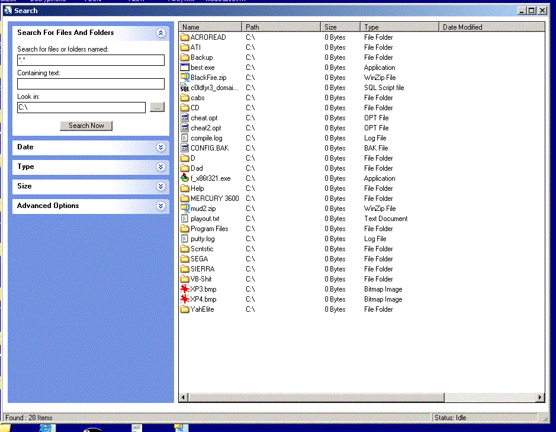



## File Search \( Advanced \)\( Must see \! \)

### Description

By far the best search submission on PSC. Search by name, type, size, and date both modified and created. Great examples of ListView, ImageCombo, File Manipulation, Icon manipulation and a whole host of other Windows API calls. This does not use any third party Acive X controls other than one or two supplied with Windows/VB Service Packs. Class automation, registry automation, file automation and more ! Fixed alot of bugs from the last submission, now allows searching multiple folders using ; as a seperator. Aswell as the normal default values for some of the check box's and more. Also fixed the bug with the icons showing the same for every file.

Please please please leave your comments, votes and suggestions !
 
### More Info
 
Search Criteria, File Name, Type, Size or Date.

File Listing.

             |
---                |---
**Submitted On**   |2003-08-18 17:19:06
**By**             |[c0ldfyr3](https://github.com/Planet-Source-Code/PSCIndex/blob/master/ByAuthor/c0ldfyr3.md)
**Level**          |Advanced
**User Rating**    |4.5 (27 globes from 6 users)
**Compatibility**  |VB 5\.0, VB 6\.0
**Category**       |[Complete Applications](https://github.com/Planet-Source-Code/PSCIndex/blob/master/ByCategory/complete-applications__1-27.md)
**World**          |[Visual Basic](https://github.com/Planet-Source-Code/PSCIndex/blob/master/ByWorld/visual-basic.md)
**Archive File**   |[File\_Searc1631938182003\.zip](https://github.com/Planet-Source-Code/c0ldfyr3-file-search-advanced-must-see__1-47819/archive/master.zip)

